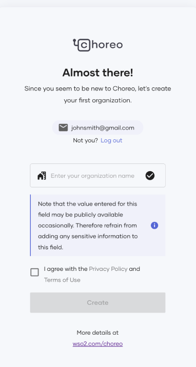
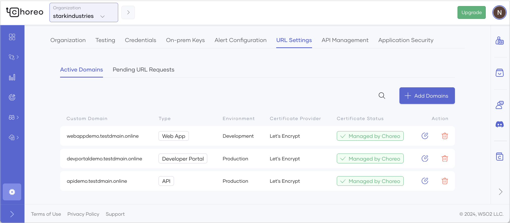
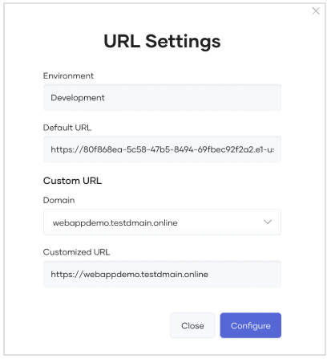
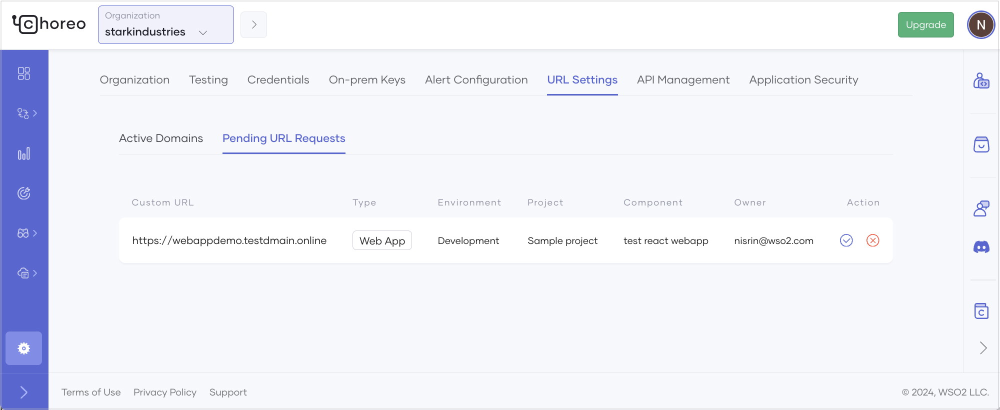

# Configure a Custom Domain for Your Organization

A custom domain is essential for effective branding, discoverability, and credibility of a website. Choreo allows you to easily configure custom domains for your organization, enabling developers to utilize it to configure custom URLs for their components such as API proxies, services, web applications, and webhooks.

This section provides an overview of Choreo’s custom domain configuration model and guides you through configuring a custom domain for your organization. It also walks you through utilizing a custom domain to configure a custom URL for a component.

## Choreo custom domain configuration model

Choreo allows organization administrators to add custom domains for their organizations. When an administrator adds custom domains to an organization, component developers can submit requests to utilize the custom domains for their respective components. These requests require approval from the organization administrator. Upon approval, the custom domain and the relevant URL customization become available to the component.

## Configure a custom domain for an organization

### Prerequisites

1. Sign in to the [Choreo Console](https://console.choreo.dev/).
2. Create an organization in Choreo.
    
    

### Add a custom domain

To add a custom domain for your organization, follow the steps given below:

!!! info "Note"
     To add a custom domain, you must have organization administrator privileges.

1. Sign in to the [Choreo Console](https://console.choreo.dev/).
2. In the Choreo Console header, click the **Organization** list.
3. In the left navigation menu, click **Settings**. This opens the organization-level settings page.
4. Click the **URL Settings** tab and then click the **Active Domains** tab.
5. Click **+ Add Domains**. 
6. In the **Add a Custom Domain** pane, do the following:
    1. Enter your domain name.
    2. Select the environment to apply the domain name.
    3. Select the entity type to apply the domain name.

        !!! tip
             In this context:

              - The **API** entity type represents Choreo components exposed via an endpoint, including API Proxy, Service, and Webhook components.
              - The **Web App** entity type represents the Web Application component.
       
 7. Take a look at the generated CNAME target value displayed and create a DNS record associating the domain name to the CNAME target value with your DNS provider.
    
    

    !!! info
          When you select **Developer Portal** as the type, the environment is not applicable, and the CNAME alias will be displayed as follows:
           

 8. Once the CNAME type DNS record is created, click **Verify**.

    !!! info "Note"
          If the CNAME mapping is correct, the verification completes successfully. It can take some time for the configured CNAME mapping to be globally available.

 9. On successful verification of the custom domain, click **Next**.
 10. Select a TLS certificate provider depending on your preference. You can either import the TLS certificates you created for the custom domain or click **Let's Encrypt** to allow Choreo to generate and manage the certificates for you.

    !!! note "If you want to import your own certificate, it should adhere to specific guidelines"
          - TLS certificate guidelines:
             - It should be issued by a certificate authority (CA) and should contain the domain's public key along with additional information such as the domain name, the company that owns the domain, the certificate's expiration date, and the digital signature of the issuing CA.
             - It should be an X509 certificate.
             - It should be in the PEM format.
             - It should be issued directly or through a wildcard entry for the provided custom URL. For example,
                - For direct issuances, the SSL file must include the exact domain name. For example, if the domain is `apis.choreo.dev`, the SSL file must include `apis.choreo.com`.
                - For wildcard entries, the SSL file should use a wildcard notation to cover all subdomains under the provided URL. For example, if the CNAME is `apis.choreo.dev`, the SSL file should use `*.choreo.dev`.
          - TLS key file guidelines:
             - It should be in the PEM format.
             - It must be encrypted using RSA encryption.
          - Certificate chain file guidelines:
             - The chain file, which is essential for some clients to verify the authenticity of a server's SSL/TLS certificate, should contain your domain's SSL/TLS certificate (optional, as this can be provided via the certificate itself) and one or more intermediate certificates in the correct order, leading back to a root certificate. 
             - All certificates in the chain should be X509 certificates in PEM format.
 
     To proceed with this step in this guide, click **Let's Encrypt**.

 11. To save the custom domain, click **Add**.
 
Now, you have successfully added a custom domain for your organization.

You can see the added custom domain listed in the **Active Domains** tab under the URL **Settings** tab.
    
 

The custom domain you added will be available to the entity types in the specified environment. You can request the custom domain when configuring a custom URL for a component.

!!! info "Note"
     If you add a custom domain for the **Developer Portal** type, the customization is applied immediately, and you can access the organization’s Developer Portal via the added domain.

If you want to view the entity types that use a particular custom domain, click the specific custom domain listed in the **Active Domains** tab under **URL Settings**.
 
## Configure a custom URL for a component

When an organization administrator adds custom domains for specific environments, developers can request any available custom domain to configure a custom URL for a component in a specific environment.

### Request a custom URL for a component

To request a custom URL for your component, follow the steps given below:

!!! info "Note"
     Before you request a custom domain for a specific environment, ensure that the component is deployed to that environment.

1. Sign in to the [Choreo Console](https://console.choreo.dev/).
2. In the **Component Listing** pane, click on the component for which you want to customize the URL.
3. In the left navigation menu, click **Settings**. This opens the component-level settings page.
4. Click the **URL Settings** tab. This displays the active deployments of the component across different environments and indicates whether a custom URL is configured. If an active custom domain is available to configure a custom URL for a component in a specific environment, the **Edit URL Mapping** icon in the corresponding **Action** column becomes enabled.
    
    

5. To configure a custom URL for a component in a specific environment, click the **Edit URL Mapping** icon under the **Action** column corresponding to the respective environment. This opens the **URL Settings** dialog, where you can specify values to request for a custom URL.
    
    

6. In the **URL Settings** dialog, select a domain to configure a custom URL.

    !!! tip
          - The **Domain** drop-down lists the available domains for the component. You can  request for any listed domain.
          - If you want to request a custom URL for an API, you must specify an appropriate context path in the **Path** field. The **Path** field displays the default context path for the API. You can edit the path depending on your preference. 

7. Click **Configure**. This creates the custom URL mapping, which you can see under the **URL Settings** tab.  The custom URL request will be in the **Pending** status until an organization administrator approves the request.
    
    

### Approve a custom URL request

When a developer requests a custom URL, the request will be listed in the organization-level settings page under the **URL Settings** tab.

To approve a custom URL mapping, follow the steps given below:

!!! info "Note"
     To approve custom URL requests, you must have organization administrator privileges.

1. Sign in to the [Choreo Console](https://console.choreo.dev/).
2. In the Choreo Console header, click the **Organization** list.
3. In the left navigation menu, click **Settings**. This opens the organization-level settings page.
4. Click the **URL Settings** tab and then click the **Pending URL Requests** tab. You will see all the pending URL mapping requests sent by developers.
    
    

5. Go to the custom URL you want to approve and click the corresponding **Approve URL Mapping** icon under the **Action** column.
6. Review the details and click **Approve**.
   
   Once approved, the invoke URL of the component gets replaced with the configured custom URL.
    
   

   Now you have successfully utilized the configured custom domain to set up a custom URL for a component.
