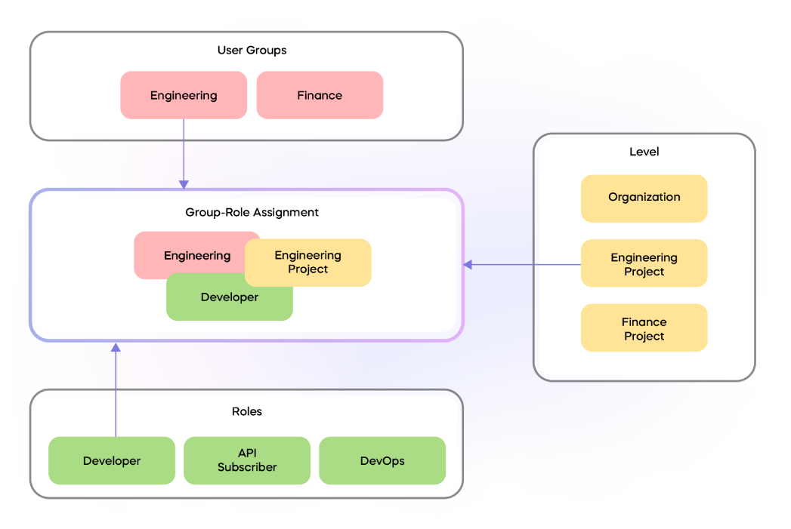
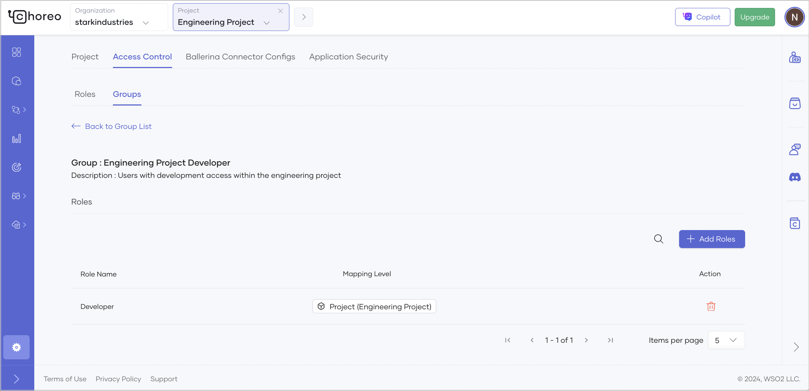

# Control Access in the Choreo Console

In the Choreo Console, you have the ability to manage access to projects and the actions that can be performed within them. Administrators have the capability to restrict project access to specific user groups. This feature is useful when you need certain user groups to have access to particular projects or for a set of projects.

Choreo uses **Roles**, **Groups**, and a **Mapping level** to control access to the Choreo Console as follows: 

- **Role** : Role is a collection of permissions. Choreo has a predefined set of roles with permissions assigned to them. [Learn more](../choreo-concepts/organization.md#roles)
- **Group** : Group is a collection of users. A user group requires a role or multiple roles to be assigned to it so that the users in those groups get the relevant permissions via the assigned roles. [Learn more](../choreo-concepts/organization.md#groups)

- **Mapping level** : A mapping level defines the extent at which a role-group mapping can be done. Choreo has two defined resource levels.
    - **Organization** : You can assign a role to a group or associate a group with a role within the organization. This ensures that    
                         all users in a group inherit the permissions granted by that role across all organizational resources.
                         For example, if a user has edit_project permission at the organization mapping level, that user can edit all the projects in the organization.
    - **Project** : You can assign a role to a group or associate a group with a role within a specific project resource. This ensures 
                    that users in the group inherit the permissions granted by that role only within the context of the specified project.
                    For example, If a user has edit_project permission at the project mapping level, that user can only edit the specified project.

In Choreo, authorization operates by assigning a role to a group at a specified level. The level at which the role is assigned determines the extent of permissions granted to users.

!!! warning "Important"
     Due to an existing limitation in Choreo, if a user is assigned the role of administrator in one project and any other role in another project within the same organization, the user will automatically have administrator-level access to both projects.

!!! info
    In Choreo, organization-level permissions take precedence over project-level permissions.

To elaborate further, refer to the following diagram. 

The following diagram depicts a role-group assignment at a specific resource level. In the diagram, an admin user has assigned the Developer role to all members of the Engineering group within the Engineering Project. This grants users in the Engineering group the ability to perform all actions allowed by the Developer role within the Engineering Project.

## Sample scenario

Now that you understand the basic concepts of access control within the Choreo Console, let’s try out a sample scenario to manage access within a project. 

Assume you are overseeing the Engineering Project within your organization and you need to grant development access to specific users solely within this project. Here's a step-by-step guide on how to achieve this:

### Step 1: Create a project

Follow the steps given below to create a project:

1. Go to [https://console.choreo.dev/](https://console.choreo.dev/) and sign in. This opens the organization home page.
2. On the organization home page, click **+ Create Project**.
3. Enter a display name, unique name, and description for the project. You can enter the values given below:
    
    !!! info
         In the **Name** field, you must specify a name to uniquely identify your project in various contexts. The value is editable only at the time you create the project. You cannot change the name after you create the project.

    | **Field**                | **Value**                          |
    |--------------------------|------------------------------------|
    | **Project Display Name** | `Engineering Project`              |
    | **Name**                 | `engineering-project`              |
    | **Project Description**  | `My sample project`                |

4. Click **Create**. This creates the project and takes you to the project home page.

### Step 2: Create a new group

Follow the steps given below to create a group with the name `Engineering Project Developer`:

1. In the Choreo Console, go to the top navigation menu, click the **Organization** list, and select the organization where you created your project.
2. In the left navigation menu, click **Settings**.
3. Click the **Access Control** tab and then click the **Groups** tab.
4. Click **+ Create Group**.
5. Enter a group name and group description. You can enter the values given below:

    | **Field**                | **Value**                          |
    |--------------------------|------------------------------------|
    | **Group Name**           | `Engineering Project Developer`    |
    | **Group Description**    | `Users with development access within the engineering project`|

6. Click **Create**.

### Step 3: Assign roles to the group

Follow the steps given below to assign the **Developer** role to the **Engineering Project Developer** group that you created:

1. In the Choreo Console, go to the top navigation menu, click the **Project** list, and select the **Engineering Project** that you created.
2. In the left navigation menu, click **Settings**.
3. Click the **Access Control** tab and then click the **Groups** tab.
4. On the **Groups** tab, search for the **Engineering Project Developer** group and click the corresponding edit icon.
5. Click **+Add Roles**. 
6. In the **Add Roles to Group in Project** dialog that opens, click the **Roles** list and select **Developer**.
7. Click **Add**. This assigns the **Developer** role to the group. You should see the mapping level as **Project (Engineering Project)** as follows, indicating the scope of the mapping:

    

   This means that you have granted developer access to users in the Engineering Project Developer group in the scope of the Engineering Project. 

Now that you have set up access control, you can proceed to add users to the new group.

### Step 4: Add users to the group

There are two approaches you can follow to add users to the group.

#### Add a new user as a project developer 

Follow the steps given below to add a new user as a project developer:

1. In the Choreo Console, go to the top navigation menu, click the **Organization** list, and select the organization where you created your project.
2. In the left navigation menu, click **Settings**.
3. Click the **Access Control** tab and then click the **Users** tab.
4. Click **+Invite Users**.
5. In the **Invite Users** dialog,
   1. Specify the email addresses of the users in the **Emails** field.
   2. Click the **Groups** list and select **Engineering Project Developer**.
6. Click **Invite**.

#### Add an existing user as a project developer 

Follow the steps given below to add an existing user as a project developer:

1. In the Choreo Console, go to the top navigation menu, click the **Organization** list, and select the organization where you created your project.
2. In the left navigation menu, click **Settings**.
3. Click the **Access Control** tab and then click the **Users** tab.
4. Search for the existing user you want to add to the **Engineering Project Developer** group.
5. Click the edit icon corresponding to the user.
6. Click **+Assign Groups**.
7. In the **Add Groups to User** dialog, click the **Groups** list and select **Engineering Project Developer**.
8. Click **Add**.

!!! tip
     Make sure to remove the user from any other groups to avoid granting organization-level access unintentionally.

!!! note
     - Existing groups are already mapped to similar roles at the organization level. Therefore, adding users to those groups or keeping users in them, will give organization-level access to the users.
     - When users are added to the **Engineering Project Developer** group, they will only have developer access to the **Engineering Project**.
     - You can invite new users or add existing users to new groups within the Engineering Project, and based on their requirements, assign roles like Developer, API Publisher, etc.

Now you have successfully set up access control within your project.
