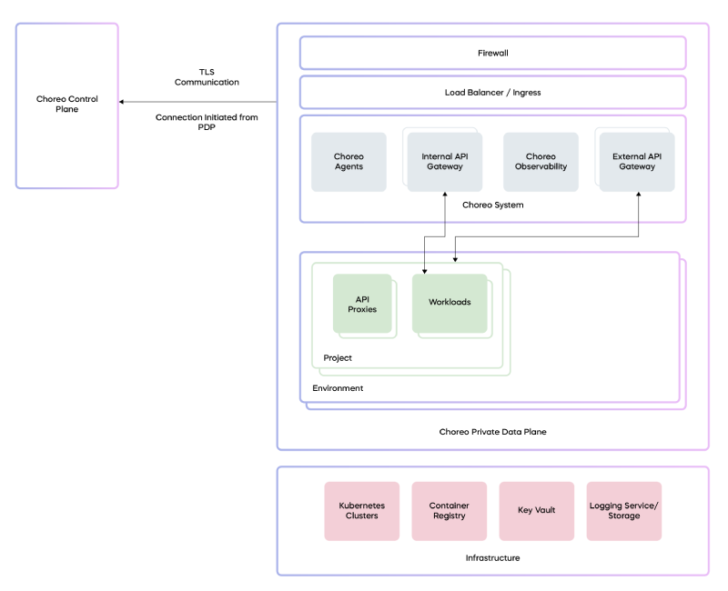

# Data Planes

At its heart, the Choreo control plane is a configuration manager and an orchestrator. It consists of many components that help developers to define and create Choreo applications. APIs manage communication between consumers and the Choreo control plane.

Similarly, the Choreo data plane is a Kubernetes cluster where applications are deployed and run. The data plane has a few system components that facilitate user applications to run with the support of the control plane. While the data plane needs support from the control plane, it can operate independently in a disaster scenario. All communication between the control plane and the data plane is made via APIs.

## Types of data planes

Choreo provides two types of data planes for users to run their cloud native applications.

### Cloud data plane

The cloud data plane is the default data plane available on Choreo. It is fully managed by WSO2 and runs on Microsoft Azure. It allows you to create and launch your applications in minutes, eliminating the need to provision infrastructure. 

The cloud data plane is an excellent solution for anyone who wants to develop and distribute applications via Choreo. However, users have limited control over the operations of the data plane since it is a multi-tenant system. To increase security among tenants executing applications in the cluster, numerous restrictions are also implemented. With the two environments designated as development and production that are configured for cloud data plane, users can build, test, and deploy their applications from development to production using the Choreo Console. However, some enterprises may want more control and flexibility than what is provided by default in the cloud data plane. 

{.cInlineImage-full}

### Private data plane

A private data plane is for users who want to have more privacy and control over their data plane. Private data planes operate alongside a user's current cloud services. As of now, private data planes are supported on Microsoft Azure and AWS. In the future, there will be more cloud providers.

Private data planes focus on satisfying these requirements by enabling organizations to create and connect a data plane on their own infrastructure, granting them greater flexibility and control. Given the solution is single-tenanted and dedicated to the client, compliance, data protection, and additional security rules can be developed with relative ease. Private data planes enable the provisioning of multiple environments such as development, test, staging, and production, which are required by most businesses. WSO2 manages the data plane on the client’s behalf and provides better SLAs and support while preserving the ease of use provided by Choreo for developing and running cloud-native applications from development to production.

{.cInlineImage-threeQuarter}
