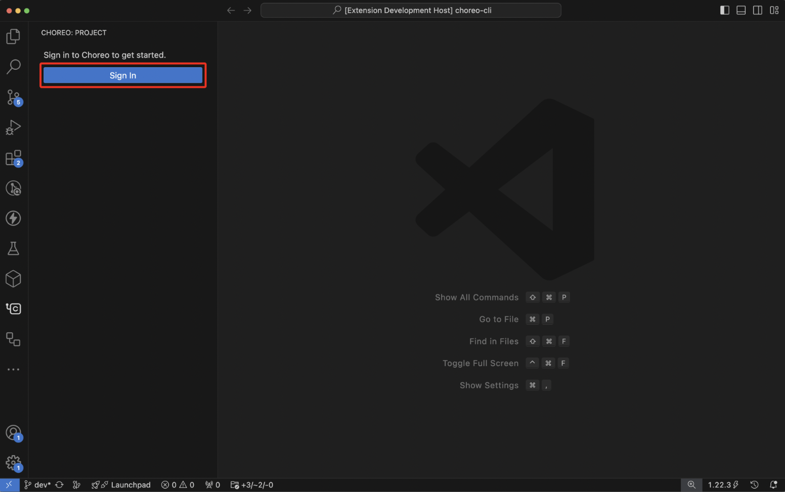
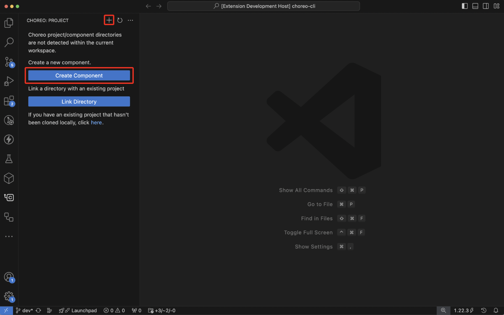

# Choreo VS Code Extension User Guide

The [Choreo VS Code extension](https://marketplace.visualstudio.com/items?itemName=WSO2.choreo) offers comprehensive component management capabilities to streamline local development within Choreo.

## Prerequisites

To ensure a smooth development experience with the Choreo extension, make sure you have the following:

1. [Visual Studio Code](https://code.visualstudio.com/download) installed with the [Choreo extension](https://marketplace.visualstudio.com/items?itemName=WSO2.choreo) version **2.0.0** or later.

2. Locally cloned GitHub repository (to create a new component or link to an existing Choreo component).

3. [Git](https://git-scm.com) version 2.0.0 or later.

## Getting Started

To utilize the capabilities of the Choreo extension in the VS Code editor, you need an active Choreo account. If you already have one, follow these steps to set up the extension:

1. Install the [Choreo VS Code extension](https://marketplace.visualstudio.com/items?itemName=WSO2.choreo) and wait for activation.

2. Sign in to Choreo using one of the following methods:
   - Click the `Sign In` button within the Choreo activity panel.
   - Use the `Sign In` command provided by the Choreo extension.
       
   

   This redirects you to an external URI to complete the authentication process. Upon successful sign-in, the Choreo activity pane will display your account details along with any components detected within the VS Code workspace.

## Create a New Component

1. Initiate the creation of a new component using one of these methods:
    - Click the `Create Component` button in the Choreo activity panel.
    - Utilize the `Create New Component` command from the Choreo extension.
   
   

2. You'll be prompted to select the organization and project for the new component. Optionally, create a new project if necessary.

3. Fill out the component details such as name, type, buildpack, etc., in the provided form.
   
   

4. After creation, the component details view will open, and the Choreo activity panel will update with the new component.

   

!!! tip 
      Once the component is created, a `.choreo/link.yaml` file will be generated within the directory. Refer [Component Links](#component-links) section for more details.

5. The component details view allows you to manage your component by performing various actions such as:
   - Triggering builds for selected commits
   - Viewing lists of builds and statuses
   - Diagnosing build failures with build logs
   - Deploying builds in available environments
   - Accessing runtime logs and deployed component URLs

## Component Links

Link files contain metadata related to the component, enabling the extension to establish associations between local directories and Choreo components. These files, named `link.yaml`, reside in the `/.choreo` folder within the component directory.

The Choreo extension scans the currently opened VS Code workspace, detecting all link.yaml files and listing them in the Choreo activity panel. This allows users to easily open and manage the components they are developing within the VS Code workspace.

It's up to the user to decide whether to commit this file to their Git repository. Committing this file enables other team members working on the same repository to have a seamless developer experience with Choreo.

Users can also unlink directories via the extension, which deletes the relevant link files.

If link files for existing components have not been committed or are unavailable for other reasons, users can easily regenerate them using one of the following options:
   - Click the `Link Directory` button in the Choreo activity panel.
   - Utilize the `Link Directory` command from the Choreo extension.

   
   

## Discover Additional Features

Access a range of functionalities provided by the Choreo extension by opening the VS Code command palette and typing `Choreo`.

## Troubleshooting

To troubleshoot Choreo extension issues:

1. Open the **OUTPUT** pane by clicking **View** and then **OUTPUT** from the main menu.

2. Select **Choreo** from the drop-down menu on the right-hand side to view Choreo output for troubleshooting.

## Get Help

Feel free to create [GitHub issues](https://github.com/wso2/choreo-vscode/issues) to reach out to us.