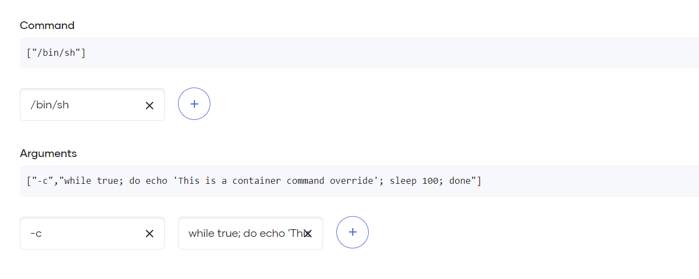

# Configure Container Resources, Commands, and Arguments

In Choreo, you can view detailed information about the container that comprises a component, such as its image tag, the corresponding commit ID, any imposed resource usage limits, and so on. 

Each component in Choreo is limited to a single main container.

{.cInlineImage-full}

!!! info "Resource Limits"
    Resource limits ensure that a single component does not take up more resources than it requires, which can affect other workloads on the data plane. If a process exceeds the allocated memory limit, the corresponding container will be forcefully shut down and restarted. If the process exceeds the allocated CPU limit, it gets throttled and can result in significant latencies in compute and I/O operations.

Choreo allows you to edit the default container configuration depending on your requirement.

## Update container configurations

Follow these steps to update container configurations:

1. Sign in to the [Choreo Console](https://console.choreo.dev/).
2. In the **Component Listing** pane, click on the component for which you want to edit container configurations.
3. In the left navigation menu, click **DevOps** and then click **Containers**.
4. On the **Containers** page, click **Edit** to update the corresponding container configuration.
5. Apply the necessary changes and click **Save**.

    {.cInlineImage-full}

The following topics walk you through the container configuration changes you can apply.

### Update resource requests and limits

!!! info "Note"
    The capability to update resource requests and limits is only available in in paid pricing plans.

To update resource requests and limits, move the corresponding slider to a required position. A resource request cannot be less than its corresponding limit.

### Set the image pull policy

You can select one of the following options as the image pull policy.

- **Always**: The image is always pulled from the container registry, even if a matching tag is already present in the data plane.
- **If Not Present** - The image is pulled from the container registry only if a matching image is not present in the data plane.

    !!! tip

          The recommended option is **If Not Present**.

### Specify container ports

You can specify appropriate values for the **Container Port** and **Service Port**. The **Service Port** is the port exposed outside of the container to your project-scoped endpoint. If you do not know the value to specify as the **Service Port**, specify the **Container Port** value in both fields.

!!! tip

      You do not need to configure port values manually for Ballerina components. The capability to edit port values is primarily for containerized/Dockerfile-based components. 

You can also select an appropriate **Protocol**. 

### Define a command and arguments for the container

You can define a command and arguments for a container when you want to provide or override the `ENTRYPOINT` of a container. For example, in a scenario where you want to run legacy or third-party applications, you would want to provide or override the `ENTRYPOINT` of a container.

{.cInlineImage-half}

When you define a command and arguments, 

- It specifies the `ENTRYPOINT` array and it is not executed within a shell. 
- Variable references `$(VAR_NAME)` are expanded using the container's environment. If a variable cannot be resolved, the reference in the input string will be unchanged.
- `$$` are reduced to `$`, which allows escaping the `$(VAR_NAME)` syntax. This means that `"$$(VAR_NAME)"` produces the string literal `"$(VAR_NAME)"`. 
- Escaped references are never expanded, regardless of whether the variable exists or not. 

The `ENTRYPOINT` of the container image is used if you do not define a command and arguments for the container.
