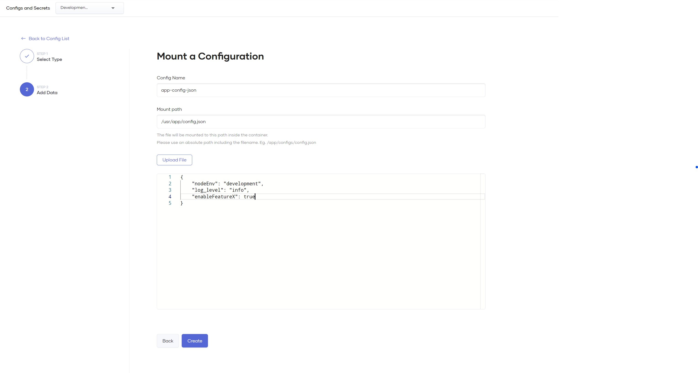
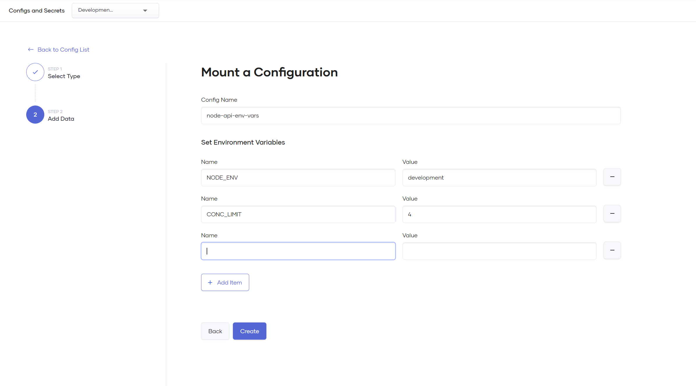

# Manage Configurations and Secrets

Choreo provides a seamless mechanism to manage and version your component's configurations and secrets as **file mounts** or **environment variables**.

!!! info "Note"
    All configurations and secrets applied to a Choreo component are stored in an encrypted secret vault in the cloud data plane, which is managed by WSO2.
    If you are on a private data plane, the configurations and secrets are stored in an Azure key vault or AWS secret manager attached to your data plane in your cloud environment.

## The difference between configurations and secrets

Choreo considers all configurations and secrets to be sensitive content when storing them, but gives you the option to choose between secret or configuration when you create a file mount or an environment variable.

- **Secrets** are write-only. Once you create a secret, you cannot see or retrieve its content via the Choreo Console. However, you can overwrite the existing content at any time.
- **Configurations** can be read and updated via the Choreo Console after you create them.
  
    !!!info "Note"

          If you want to include sensitive data such as database passwords, cloud credentials, service accounts, and so on, the recommended approach is to use a secret instead of a configuration.

## Apply a file mount to your container

Follow these steps to apply a file mount to a component you have created:

1. Go to the **Deploy** view of the component for which you want to define configurations and secrets.
2. Click **Configs & Secrets** and then click **+ Create**.
3. In the **Mount a Configuration pane**, do the following:
    1. Select a **Config Type** depending on your requirement.
    2. Select **File Mount** as the **Mount Type**.
    3. Click **Next**.
    4. In the **Config Name** field, specify a name for the file mount.
  
        !!!tip

                The configuration name does not affect the file mount or its content. It is only a reference to identify the configuration or secret you create.

    5. In the **Mount Path** field, specify where to mount the file inside the container. Use an absolute file path with the file name and extension if applicable.
  
        !!!tip

                The file name in the mount path does not need to match the configuration name or the name of the file you upload.

    6. Upload a configuration file or copy and paste the configuration content into the editor.

4. Click **Create**.

    {.cInlineImage-full}
  
    !!!info "Note"
           
            Configurations and secrets are applied immediately to your environment on creation. The running replicas you have undergo a rolling restart to ensure the new content gets reflected in the container.

## Apply environment variables to your container

Follow these steps to apply environment variables to a component you have created:

1. Go to the **Deploy** view of the component for which you want to define configurations and secrets.
2. Click **Configs & Secrets** and then click **+ Create**.
3. In the **Mount a Configuration pane**, do the following:
    1. Select a **Config Type** depending on your requirement.
    2. Select **Environment Variables** as the  **Mount Type**.
    3. Click **Next**.
    4. In the **Config Name** field, specify a name.
  
        !!!tip

                The configuration name you specify does not affect the environment variables you set. It is only a reference to identify the configuration or secret you create.

    5. Add the necessary environment variables as key-value pairs. You can click **Add Item** to add any number of environment variables.

4. Click **Create**.
   
    {.cInlineImage-full}

## Update an existing configuration or secret

Follow these steps to update a configuration or secret you have defined:

1. Go to the **Deploy** view of the component for which you have defined the configuration or secret.
2. Click **Configs & Secrets**.
3. Click the edit icon corresponding to the configuration or secret you want to update and do the necessary changes.
4. Click **Save**.

    {.cInlineImage-half}

## Delete an existing configuration or secret

Follow these steps to delete a configuration or secret you have defined:

1. Go to the **Deploy** view of the component for which you have defined the configuration or secret.
2. Click **Configs & Secrets**.
3. Click the delete icon corresponding to the configuration or secret you want to delete, and enter the name of the configuration or secret.
4. Click **Confirm**.

## Manage Ballerina configurables

Choreo manages the [Ballerina configurables](https://ballerina.io/learn/by-example/configurable-variables/) for the Ballerina components you create.

When you deploy or promote a Ballerina application, you can modify the Ballerina configurables via the **Build and Deploy** page.
  
!!!tip

      You can use configurables instead of environment variables to add file mounts to a Ballerina component.
      Environment variables are primarily for components written in other languages.
