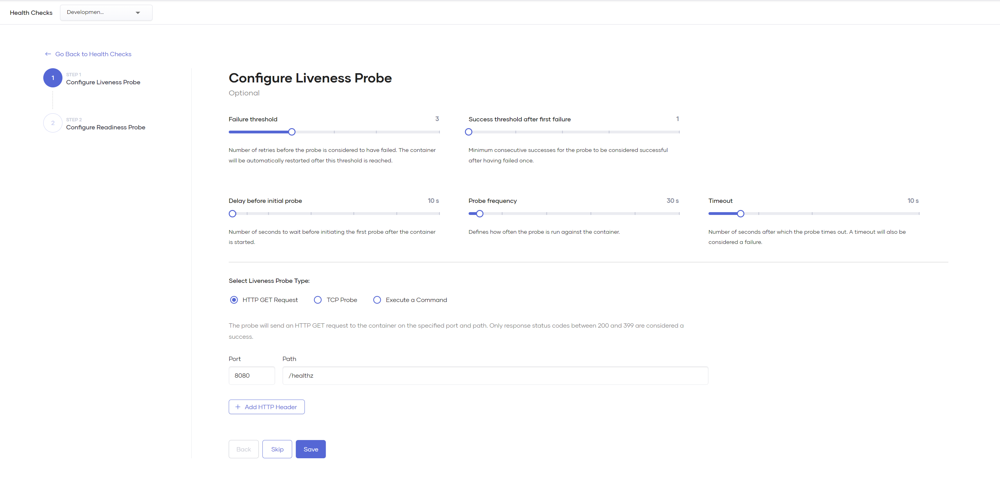

# Set Up Health Checks

Health checks ensure that a running container is always healthy and ready to serve traffic.

## Liveness probes

Liveness probes run periodically on your container and restart if the probe fails.
This allows the container to self-heal in scenarios where the application may have crashed or become unresponsive.

## Readiness probes

Similar to liveliness probes, readiness probes run periodically throughout the lifecycle of a container.
However, unlike liveliness probes, it does not restart the container if the probe fails. Instead, it stops the container from receiving network traffic.

!!! warning "Readiness probes on single replicas"
    You must be mindful when you configure readiness probes on a single-running replica. If the readiness probe fails, your application stops receiving traffic  because there is only one active replica. The application may not recover unless the liveness probe fails and restarts the container.

## Probe types

You can configure the following probe types for both readiness and liveness probes.

### HTTP `GET` request

This probe sends an HTTP `GET` request to a specified port and path on the container. A response status code in the range of 200-399 indicates that the request is a success.

Depending on your requirement, you can configure additional HTTP headers.

The recommended approach is to create a `/healthz` or `/health` endpoint in your service for this purpose.

{.cInlineImage-half}

### TCP connection probe

This probe attempts to open a socket to the container on the specified port. If it cannot establish a TCP connection, it becomes a failure.

### Execute a command

This probe executes the given script inside the container. A non-zero return from the command is considered a failure.

For example, `["cat", "/tmp/healthy"]` is considered healthy if the file `/tmp/healthy` is present. If not, it becomes a failure (non-zero exit code).
In such scenarios, the application is responsible for writing and maintaining this file in the specified location.

## Configure liveness and readiness probes

Follow these steps to configure liveliness and readiness probes on a container:

1. Go to the **Deploy** view of the component for which you want to configure liveliness and readiness probes.
2. Click **Health Checks**.
3. In the **Health Checks** pane, click **+ Create**.
4. Configure the liveness probe and readiness probe depending on your requirement.

    {.cInlineImage-full}
  
    !!!info "Note"

          You can update or remove a probe at any time.

Follow these steps to ensure that the container works as expected:

1. In the left navigation menu, click **Runtime**.
2. In the **Runtime** pane, check the details to confirm that the container works as expected. If the container does not start, check the **events and conditions** to see if any of the probes are causing the container to fail.
