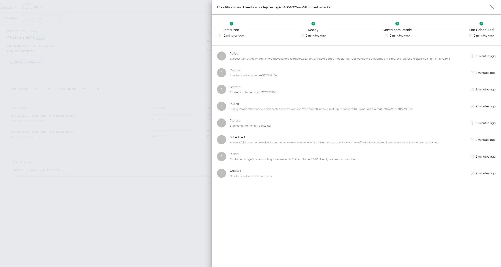

# View Runtime Details

In Choreo, you can view details about running replicas of a component in a specific environment (i.e., Development or Production).

To view the runtime details of a component, go to its **Deploy** view, and click **Runtime** in the left navigation menu. This displays the **Runtime** pane populated with data retrieved from the underlying Choreo data plane.

{.cInlineImage-full}

The runtime details you can see here are analogous to a *zoomed-in* view of a specific environment in the **Build and Deploy** section.

The following topics walk you through the specific details you can view and actions you can perform via the **Runtime** pane:

## Redeploy a release

In the **Runtime** pane, you can click **Redeploy Release** to immediately redeploy all resources, including configurations and secrets, to a specific environment. This triggers a rolling update to sync all the latest changes to the data plane.

!!! info "What is a release?"
    A Release in Choreo uniquely identifies an underlying deployment of a component in an environment for a given version. For example, if you deploy a component to two environments across two versions, the component will have four active releases.

The capability to redeploy a release also allows you to quickly restart all the running replicas of a component in a specific environment.

## View running instances

The running instances you see in the **Runtime** pane provide insights into the active replicas of your component in the selected environment.

- You can view details of each active replica and its associated real-time CPU and memory usage, status, restarts, and the time of the last activity.
- If you want to see the real-time logs and information on conditions and events of a replica, click the menu icon of the replica and then click **Real-time Logs** or **Conditions & Events**, depending on what you need to view. These options provide insights that help to diagnose issues in deployments.

    {.cInlineImage-full}

    !!! info "Note"
        - All metrics such as the total and replica-level CPU and memory usage displayed in the **Runtime** pane are real-time data and are instantaneous representations of a component's current state. 
        - You can go to the **Observability** view of a component to see historical metrics and usage trends.

### Observe real-time container logs

Unlike the logs available in the **Observability** view of a component, these logs are fetched in real-time from the data plane and are not historical. Therefore, you can only see logs of active containers and logs from the last shutdown container.

{.cInlineImage-full}

- **Display Previous Logs:** Enable to retrieve logs from the last shutdown/crashed/restarted container of an instance.
- **Since Seconds**: Fetch logs only for the last specified number of seconds.  
- **Filter Logs**: Enable to filter and displays matching log lines. This is a fuzzy string search.

### View container conditions and events

Conditions and events provide information necessary to troubleshoot failing deployments. 

{.cInlineImage-full}

If a component is not behaving as excepted and you cannot see any issues in the application logs, these events can provide necessary debugging information, such as the following:

- Failing health checks (liveness and readiness probes).
- Missing or invalid configuration/secret mounts.
- Missing or invalid storage volume mounts.
- Scheduling issues in the underlying data plane.
