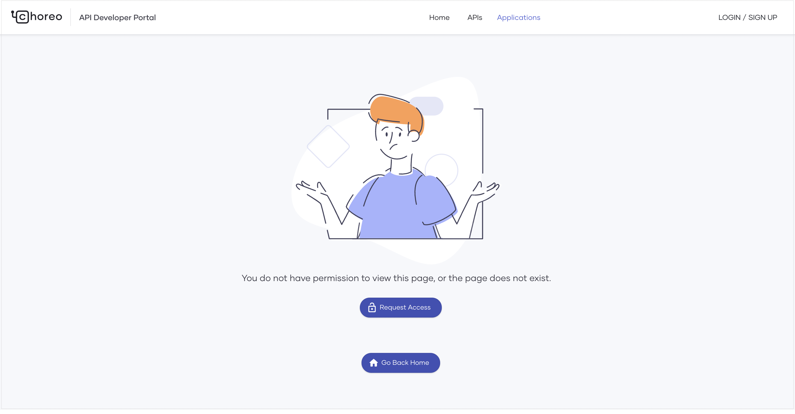
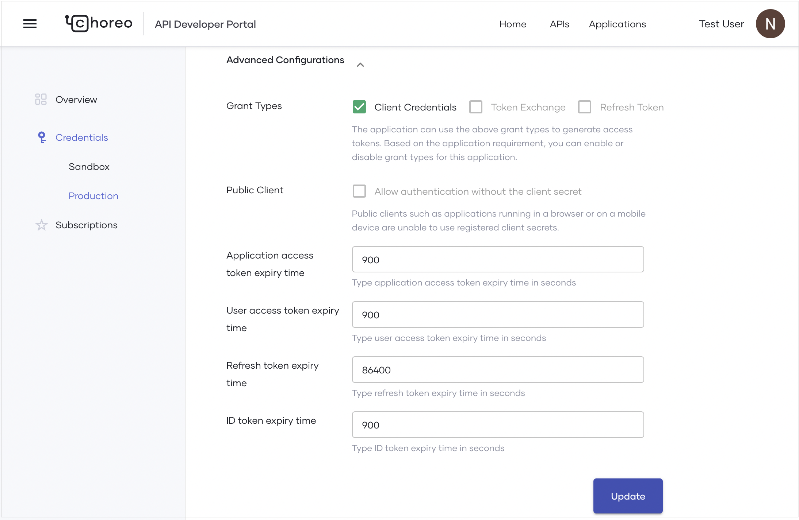
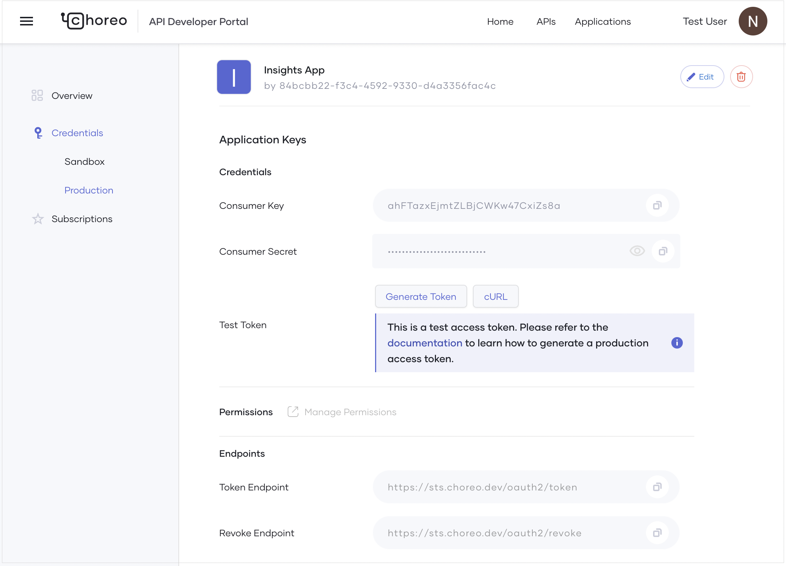

# Access the Choreo Insights API

The **Usage Insights** page in the Choreo Console displays data retrieved from the Insights API exposed over the Internet. However, in some scenarios, you may need to retrieve data from external systems and implement custom dashboards to display the data.

Choreo provides a secure and user-friendly approach to accomplish this requirement. Follow the steps given below:

## Become a member of the Choreo System organization

1. Access the Developer Portal of the `Choreo System` organization via [https://devportal.choreo.dev/choreosystem](https://devportal.choreo.dev/choreosystem) and sign in using your Google, GitHub, or Microsoft account.

2. In the top menu of the Developer Portal, click **Applications**.
   
3. To obtain access to the `Choreo System` organization, click **Request Access**.

    {.cInlineImage-full}

    This grants you access and automatically adds you as a member of the `Choreo System` organization. To verify, go to the top menu of the Developer Portal and check whether the `Choreo System` organization appears in your list of organizations.

    {.cInlineImage-full}

## Create an application and generate keys

To create an application and generate keys, follow the steps below:

1. To create a new application in the `Choreo System` organization, click **+ Create Application**. 

2. Enter a name for the application and click **Create**. This creates the application and takes you to the **Overview** page.

3. To subscribe to the **Insights** API via the newly created application, follow the steps below:
    1.  In the left navigation menu, click **Subscriptions**.
    2.  In the **Subscription Management** pane, click **+ Add APIs**.
    3.  Search for `Insights` and click **Add**.

4. To generate credentials for the application, follow the steps given below:
    1. In the left navigation menu, click **Production** under **Credentials**.
    2. Click **Generate Credentials**. Choreo generates tokens and populates the **Consumer Key** and **Consumer Secret** fields in the **Application Keys** pane.

5. To specify an appropriate token expiry time for the application, follow the steps given below:
    1. In the **Application Keys** pane, click to expand **Advanced Configurations**.
    2. Specify an appropriate value in the **Application access token expiry time** field and click **Update**.
   
        {.cInlineImage-threeQuarter}

6. Execute the following cURL command to generate an access token:

    ```bash
    curl --location --request POST 'https://sts.choreo.dev/oauth2/token' \
    --header 'Authorization: Basic <BASE64_ENCODED_CONSUMER_KEY_AND_CONSUMER_SECRET_OF_YOUR_APP_HERE>' \
    --header 'Content-Type: application/x-www-form-urlencoded' \
    --data-urlencode 'grant_type=client_credentials' \
    --data-urlencode 'orgHandle=<YOUR_ORG_HANDLE_HERE>' \
    --data-urlencode 'scope=apim:api_manage'
    ```

    !!! info
        To obtain your organization handle, follow the steps given below:

         1. Go to [https://console.choreo.dev](https://console.choreo.dev) and sign in using your Google, GitHub, or Microsoft account.
         2. In the Choreo Console, click your username in the top right corner.
         3. In the drop-down menu, click **Settings**.
         4. In the **Organization** pane, click **Copy Handle**. 

    You can use the generated token to access the Insights API exposed via [https://choreocontrolplane.choreo.dev/93tu/insights/1.0.0/query-api](https://choreocontrolplane.choreo.dev/93tu/insights/1.0.0/query-api).

    The following is a sample cURL command to invoke the Insights API:

    ```bash
    curl --location --request POST 'https://choreocontrolplane.choreo.dev/93tu/insights/1.0.0/query-api' \
    --header 'Content-Type: application/json' \
    --header 'Authorization: Bearer <TOKEN_HERE>' \
    --data-raw '{"query":"query ($org: OrgFilter!) {listEnvironments(org: $org){id\n name}}","variables":{"org":{"orgId":"<ORG_UUID_HERE>"}}}'
    ```

    !!! tip
         - When the token expires, you can generate a new token programmatically by making an API call to the token endpoint using the client credentials grant type.
        - If a token theft occurs, you can revoke the token by making an API call to the revoke endpoint.

        {.cInlineImage-threeQuarter}
