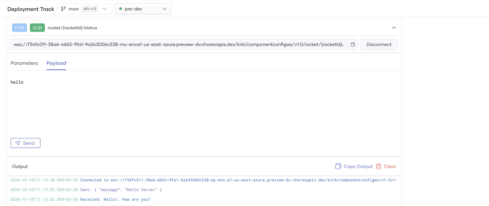

# Test GraphQL Endpoints via the GraphQL Console

Choreo provides an integrated WebSocket Console to test publicly exposed WebSocket endpoints of Service components you create and deploy. The WebSocket test Console allows you to connect to the service and interactively pass messages. As Choreo uses OAuth2.0 authentication by default to secure WebSocket APIs, the GraphQL Console generates test keys to test APIs.

Follow the steps below to test a WebSocket endpoint via the WebSocket Console:

1. Sign in to the [Choreo Console](https://console.choreo.dev/).

2. In the **Component Listing** pane, click on the component you want to test.

3. Click **Test** in the left navigation menu and then click **Console**. This opens the **GraphQL Console** pane.

4. In the **GraphQL Console** pane, select the environment from the drop-down list.

5. Select the required endpoint from the **Endpoint** list.

    !!! note
        - The **Network Visibility** of an endpoint is set in the **endpoints.yaml**. You can set it to **Public**, **Organization**, or **Project**.
        - If you have set the **Network Visibility** of the endpoint in the **endpoints.yaml** to **Public**, continue with step 7. 
        - If you have set the **Network Visibility** of the endpoint in the **endpoints.yaml** to **Organization**, the GraphQL endpoint will not be invokable from outside the organization. In this instance, for testing purposes, Choreo allows you to generate a temporay test URL that will be active for 15 minutes. Execute step 6 to generate the temporary URL. 
        
6. If the **Network Visibility** of the endpoint is set to **Organization**, click on **Generate URL** to generate a temporary test URL that will be active for 15 minutes. Else, skip this step. 

    !!! note
        The temporay test URL will be available **only for 15 minutes** and it will get expired after. You can deactivate the test URL by clicking on the **Deactivate URL** button.

    {.cInlineImage-full}

7. Expand the channel you want to test.

8. Click connect. You can see the connection status in output logs.

9. Send and recieve messages to and from the deployed Service.
    
    !!! note
         The maximum connection duration is limited to 15 Minuites and the connection will be terminated after. You can retry creating a connection by clicking the Connect Button.
